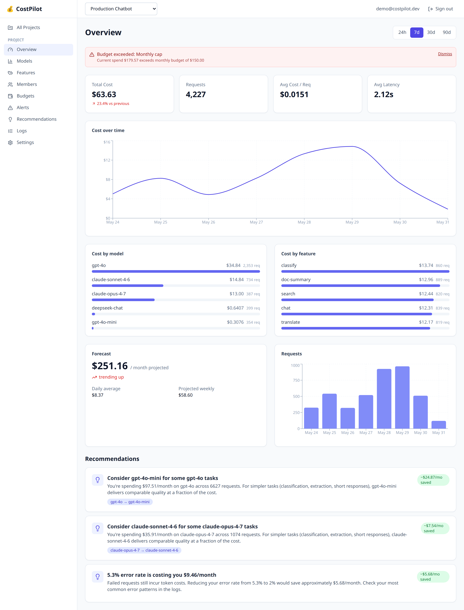
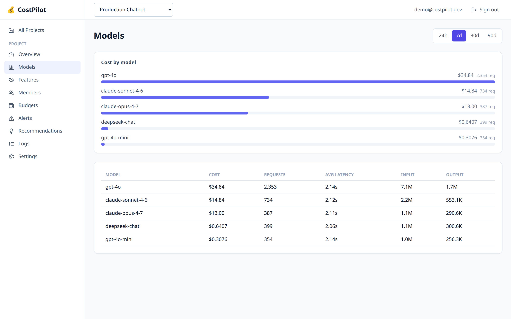
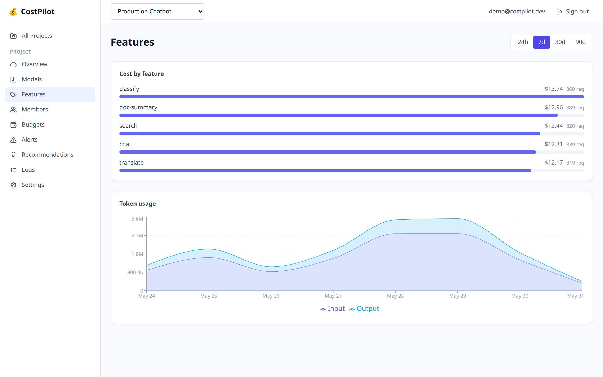
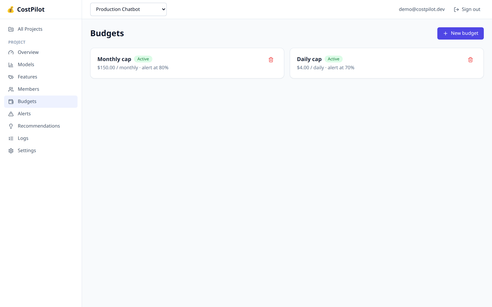
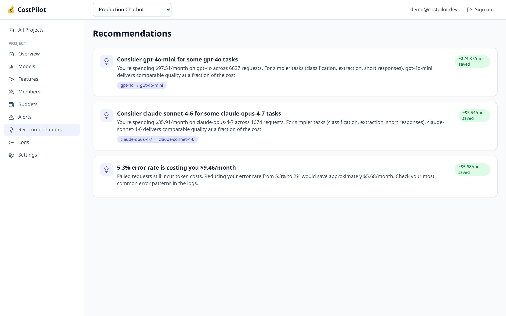
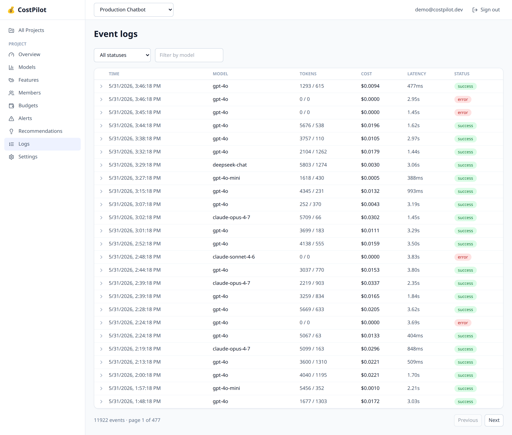

# 💰 CostPilot — LLM Cost Analytics & Optimization Dashboard

**Track, analyze, and optimize your LLM API spending. Three lines of code to monitor every OpenAI and Anthropic call — cost, tokens, latency, and errors — in a self-hosted dashboard.**

CostPilot is an open-source, self-hosted platform for **LLM cost tracking and observability**. Drop the lightweight Python SDK into your app and every call to OpenAI, Anthropic, Google, or DeepSeek is automatically tracked. You get real-time spend dashboards, per-model and per-feature cost breakdowns, budget alerts, cost forecasting, and optimization recommendations — without sending your data to a third party.

If you've ever asked *"how much are we actually spending on GPT-4o this month?"* or *"which feature is burning our token budget?"*, this is for you.



---

## Table of contents

- [Why CostPilot](#why-costpilot)
- [Features](#features)
- [Quick start](#quick-start)
- [Python SDK](#python-sdk)
- [Screenshots](#screenshots)
- [Architecture](#architecture)
- [API reference](#api-reference)
- [CostPilot vs Helicone vs LangSmith](#costpilot-vs-helicone-vs-langsmith)
- [FAQ](#faq)
- [Tech stack](#tech-stack)
- [Development](#development)
- [License](#license)

---

## Why CostPilot

LLM bills are unpredictable and opaque. Costs are scattered across providers, hard to attribute to teams or features, and easy to let run away. Existing tools either lock your data in a SaaS, focus on tracing instead of cost, or are too heavy to drop into a side project.

CostPilot is deliberately narrow and self-hosted:

- **SDK-first** — instrument an app in 3 lines, zero changes to your call sites.
- **Cost-focused** — built for FinOps on AI spend, not full request tracing.
- **Self-hosted** — your usage data stays in your own Postgres. Run it with one `docker compose up`.
- **Zero overhead** — the SDK batches events on a background thread and never blocks or crashes your application. If the backend is down, events are dropped silently.

It's the dashboard layer on top of code-level cost tracking — the full-stack evolution of [TokenBudget](https://pypi.org/project/tokenbudget/).

## Features

- 📊 **Real-time cost dashboard** — total spend, cost over time, requests, average cost per request, and latency at a glance.
- 🧩 **Breakdowns by model, feature, and team member** — see exactly where the money goes (cost by `gpt-4o` vs `claude-sonnet-4-6`, cost by `feature:doc-summary`, cost by `user:alice`).
- 💸 **Budget management & alerts** — set daily / weekly / monthly budgets per project and get warned at a threshold or when you blow past it.
- 📈 **Cost forecasting** — *"At current rate, you'll spend $251/month"* with trend detection (increasing / stable / decreasing).
- 💡 **Optimization recommendations** — automatic suggestions: downgrade overkill models, cut error waste, compress long prompts, tackle cost concentration.
- 🔑 **API key management** — generate and revoke project keys for the SDK; keys are SHA-256 hashed and shown only once.
- 👥 **Team management** — multiple members per project, usage tracked per user.
- 🧾 **Raw event log** — paginated, filterable table of every tracked call with full token and tag detail.

## Quick start

You need Docker and Docker Compose. To run the full stack (Postgres + API + dashboard):

```bash
git clone https://github.com/aryanjp1/costpilot.git
cd costpilot
cp .env.example .env          # set SECRET_KEY etc.
docker compose up -d --build  # starts db, backend (:8787), frontend (:3000)
```

Open the dashboard at **http://localhost:3000**, register an account, and create a project.

Then install the SDK in your LLM app and start tracking:

```bash
pip install costpilot
```

```python
import costpilot
import openai

costpilot.init(
    api_key="cp_proj_abc123def456",      # generate this in the dashboard
    endpoint="http://localhost:8787",
    default_tags={"service": "chatbot"},
)

client = costpilot.wrap_openai(openai.OpenAI())

# Use the client exactly as before — every call is now tracked.
response = client.chat.completions.create(
    model="gpt-4o",
    messages=[{"role": "user", "content": "Hello"}],
)
```

Your calls show up in the dashboard within a few seconds.

> **Want demo data?** Generate a project API key in the dashboard, then run
> `python scripts/generate_sample_data.py --api-key cp_proj_... --endpoint http://localhost:8787`
> to populate 30 days of realistic usage.

## Python SDK

The SDK is dead simple and has a single dependency (`httpx`).

### Track OpenAI calls

```python
client = costpilot.wrap_openai(openai.OpenAI())
```

### Track Anthropic calls

```python
import anthropic

client = costpilot.wrap_anthropic(anthropic.Anthropic())

response = client.messages.create(
    model="claude-sonnet-4-6",
    max_tokens=1024,
    messages=[{"role": "user", "content": "Hello"}],
)
```

### Per-call tags for feature-level tracking

Attach tags to any call through the `x-costpilot-tags` header (a comma-separated list of `key:value` pairs):

```python
response = client.chat.completions.create(
    model="gpt-4o",
    messages=[{"role": "user", "content": "Summarize this document"}],
    extra_headers={"x-costpilot-tags": "feature:doc-summary,user:alice"},
)
```

The dashboard then breaks spending down by `feature`, `user`, `service`, `environment`, or any tag you choose.

### How it works

- `init()` starts one background client with a daemon flush thread.
- Each wrapped call enqueues an event; the queue flushes on a timer or when a batch fills.
- Sending happens on throwaway threads — your request path is never blocked, and the SDK never raises into your application.

## Screenshots

**Per-model cost breakdown** — cost, request count, latency, and token usage for each model.



**Cost by feature + token usage** — attribute spend to the features that drive it.



**Budgets & alerts** — set caps per project and get alerted before costs run away.



**Optimization recommendations** — actionable, dollar-quantified savings suggestions.



**Event log** — every tracked LLM call, paginated and filterable.



## Architecture

```
┌──────────────────┐
│ Your LLM App     │
│ + CostPilot SDK  │──(async HTTP)──▶ ┌──────────────┐     ┌──────────────┐
│ (3 lines added)  │                   │   FastAPI    │────▶│  PostgreSQL  │
└──────────────────┘                   │   Backend    │     │              │
                                       └──────┬───────┘     └──────────────┘
┌──────────────────┐                          │
│  React Frontend  │──────────────────────────┘
│  (Dashboard)     │
└──────────────────┘
```

The SDK sends events asynchronously and never blocks the LLM call. The ingest endpoint authenticates with project API keys (not user JWTs), bulk-inserts events, and evaluates budgets in the background.

## API reference

All dashboard endpoints are under `/api` and authenticate with a JWT bearer token. The SDK ingest endpoint authenticates with a project API key.

```
# Auth
POST   /api/auth/register
POST   /api/auth/login
GET    /api/auth/me

# Projects & members
GET    /api/projects
POST   /api/projects
GET    /api/projects/{id}/members
POST   /api/projects/{id}/members/invite

# API keys (for the SDK)
GET    /api/projects/{id}/api-keys
POST   /api/projects/{id}/api-keys        # returns the full key once
DELETE /api/api-keys/{id}

# Ingest (SDK → backend, API-key auth)
POST   /api/ingest

# Analytics
GET    /api/projects/{id}/analytics/overview?period=7d
GET    /api/projects/{id}/analytics/cost-timeline?period=7d&granularity=hour
GET    /api/projects/{id}/analytics/models?period=7d
GET    /api/projects/{id}/analytics/tags?period=7d&tag_key=feature
GET    /api/projects/{id}/analytics/latency?period=7d&granularity=hour

# Forecast, budgets, alerts, recommendations
GET    /api/projects/{id}/forecast
GET    /api/projects/{id}/budgets
POST   /api/projects/{id}/budgets
GET    /api/projects/{id}/alerts
GET    /api/projects/{id}/recommendations
```

Interactive API docs are served at `http://localhost:8787/docs`.

## CostPilot vs Helicone vs LangSmith

| | **CostPilot** | Helicone | LangSmith |
|---|---|---|---|
| Self-hosted | ✅ Yes (your Postgres) | Partial | Partial |
| Primary focus | LLM **cost analytics** | Proxy + observability | Tracing + eval |
| Integration | SDK wrapper, 3 lines | Proxy / base URL | Callbacks / tracer |
| Cost forecasting | ✅ Built-in | Limited | ❌ |
| Optimization tips | ✅ Built-in | ❌ | ❌ |
| Blocks your request path | ❌ Never | Proxy adds a hop | Depends |
| Data leaves your infra | ❌ No | Yes (hosted) | Yes (hosted) |

CostPilot doesn't try to be everything. If you want a lightweight, self-hosted tool focused purely on **understanding and reducing AI spend**, that's the niche it fills.

## FAQ

**How do I track OpenAI API costs?**
Install the `costpilot` SDK, call `costpilot.init(...)`, and wrap your client with `costpilot.wrap_openai(openai.OpenAI())`. Every `chat.completions.create` call is tracked with model, tokens, cost, and latency.

**How do I track Anthropic / Claude API costs?**
Use `costpilot.wrap_anthropic(anthropic.Anthropic())`. Claude's `messages.create` calls are tracked the same way.

**Does the SDK slow down my application?**
No. Events are queued in memory and flushed by a background thread in batches. The tracking code never blocks your LLM call and is wrapped so it can never raise into your app.

**What happens if the CostPilot backend is down?**
The SDK silently drops events and your application keeps working normally. Tracking is best-effort and never a hard dependency.

**Is my usage data private?**
Yes. CostPilot is fully self-hosted — events are stored in your own PostgreSQL database. Nothing is sent to a third-party service.

**Can I track cost per feature or per user?**
Yes. Pass `extra_headers={"x-costpilot-tags": "feature:doc-summary,user:alice"}` on any call and the dashboard will break spend down by those tags.

**Which models are supported for cost calculation?**
GPT-4o / 4.1 / o3 / o4-mini, Claude Opus / Sonnet / Haiku, Gemini 2.5, and DeepSeek, with up-to-date per-million-token pricing. Unknown models are recorded at zero cost rather than guessed.

## Tech stack

- **SDK:** Python 3.10+, `httpx`, zero other dependencies.
- **Backend:** FastAPI, SQLAlchemy 2.0 async (asyncpg), Pydantic v2, Alembic, JWT auth, PostgreSQL 16.
- **Frontend:** React 18 + TypeScript, Vite, TanStack Router & Query, Tailwind CSS, Recharts.
- **Infra:** Docker + Docker Compose.

## Development

Run the test suite (SDK + backend, 60+ tests):

```bash
# SDK
cd sdk/python && pip install -e ".[dev]" && pytest

# Backend
cd backend && pip install -e ".[dev]" && pytest
```

Run services individually:

```bash
make backend     # uvicorn on :8787
make frontend    # vite dev server on :3000
make test        # SDK + backend tests
```

## License

[MIT](LICENSE) © Aryan Sharma

---

**Keywords:** LLM cost tracking · OpenAI cost dashboard · Anthropic Claude cost monitoring · AI spend analytics · token usage tracking · LLM observability · self-hosted Helicone alternative · LLM FinOps · GPT-4o cost calculator · prompt cost optimization.
